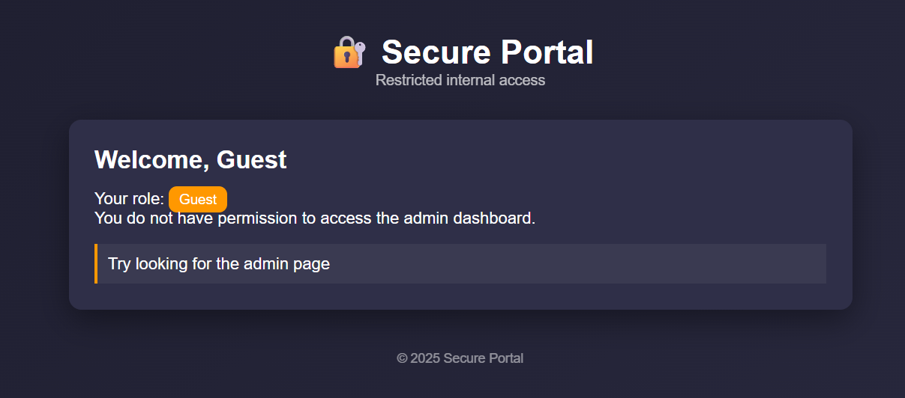
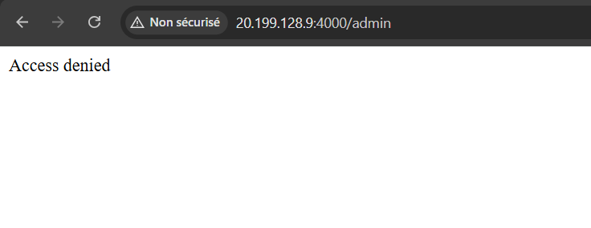
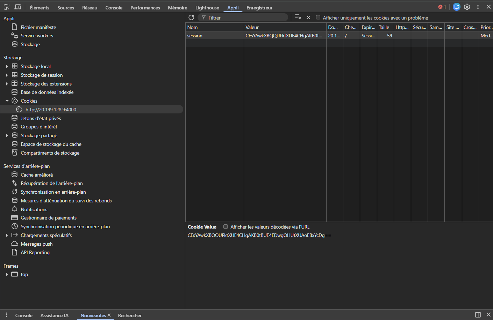
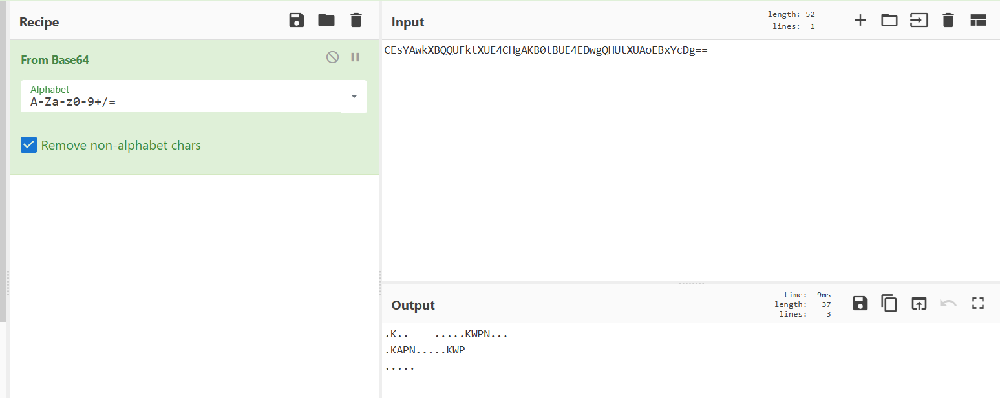
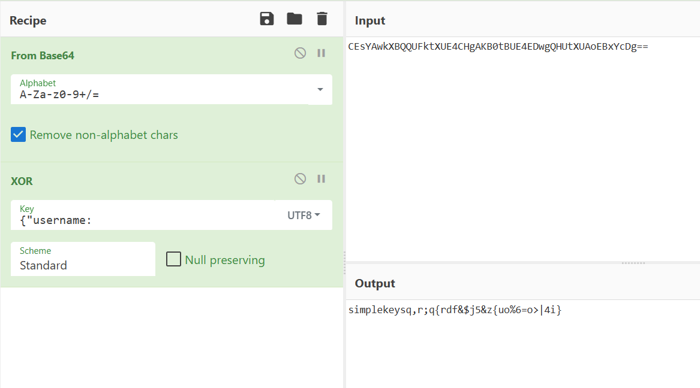
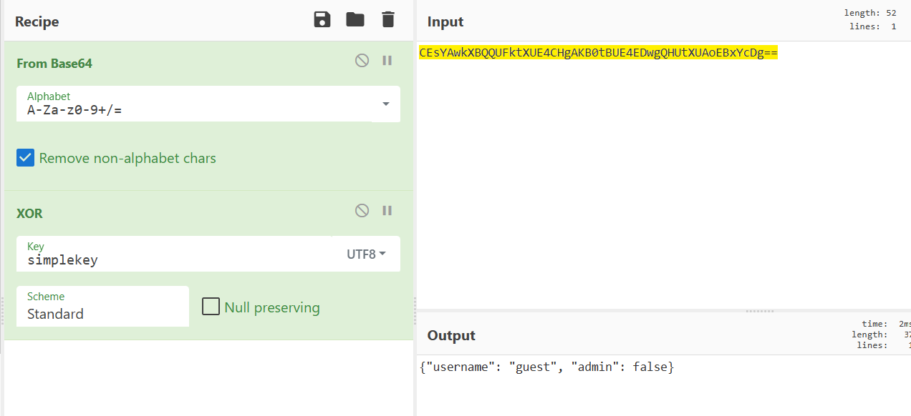
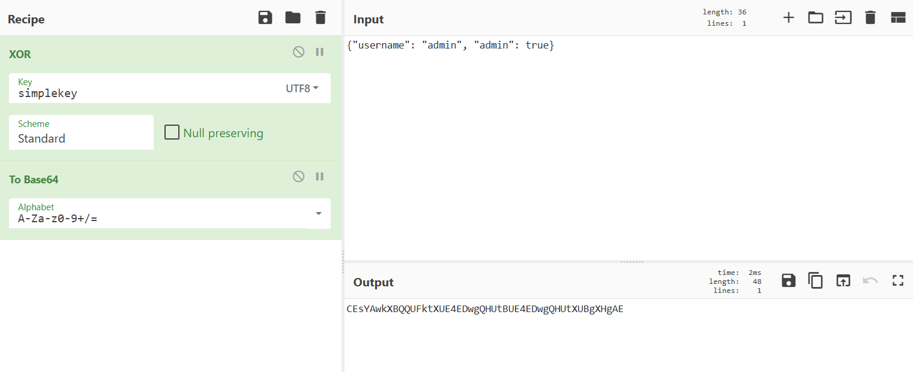
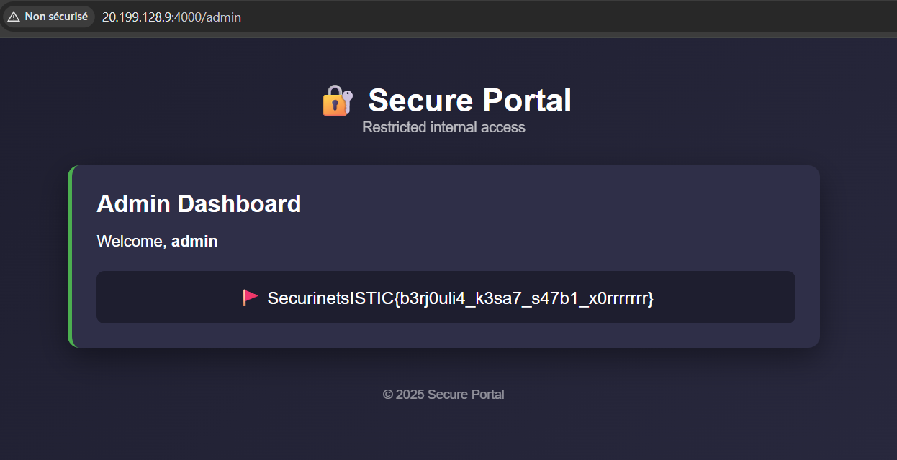

# Biscuits — Cookie Forgery via XOR (400 pts)

**Challenge name:** Biscuits  
**Author:** Rayene9052  
**Difficulty:** Medium  

---

## Challenge Description

Like usual  
The flag is at `/admin`


---

## Writeup (Step-by-Step)

We start by visiting the application.

We see **Welcome, Guest** on the home page, meaning we are logged in as a normal user.  



When we try to go directly to the admin panel:

```
/admin
```

We get **Access denied**.



So the first reflex is to check **cookies**, because authentication clearly relies on them.

---

## Inspecting the Session Cookie

Looking at the browser cookies, we notice a strange value:

```
session = CEsYAwkXBQQUFktXUE4CHgAKB0tBUE4EDwgQHUtXUAoEBxYcDg==
```



This does not look like a standard Flask session cookie.

So we try decoding it with **CyberChef (Base64)**.



The output is unreadable garbage.

This means:
- It is not just Base64
- The data is **encrypted**

At this point, several ideas come to mind:
- AES?
- Vigenère?
- Custom cipher?
- XOR?

Given this is a CTF challenge and the output length stays the same, **XOR encryption** is a very strong candidate.

---

## Key Insight — Known Plaintext

We already know something extremely important:

- We are logged in as **guest**
- A very common session structure should start like( tha9afa 3amma ):

```json
{"username":
```

From a crypto player perspective, this immediately suggests a **known-plaintext attack**.

If the cookie is:

```
ciphertext = plaintext ⊕ key
```

Then:

```
key = ciphertext ⊕ plaintext
```

---

## Recovering the XOR Key

Using CyberChef:

1. From Base64  
2. XOR with UTF-8  



We can clearly see a repeating key appear in the output:

```
simplekey
```

That’s it — the XOR secret is completely broken.

---

## Decoding the Original Session

Now that we know the key, we can fully decrypt the cookie.



Decoded content:

```json
{"username": "guest", "admin": false}
```

Exactly what we expected.

---

## Forging an Admin Cookie

Now comes the privilege escalation.

We modify the payload to:

```json
{"username": "admin", "admin": true}
```

Then:

1. XOR it with the recovered key `simplekey`
2. Encode the result in Base64



This gives us a perfectly valid admin session cookie.

---

## Getting the Flag

We replace the cookie in the browser with the forged one and refresh `/admin`.



Access granted — and the flag is revealed.

---

## Flag

```
SecurinetsISTIC{b3rj0uli4_k3sa7_s47b1_x0rrrrrr}
```

---

## Why This Works (Source Code Explanation)

Even though the source code is **not provided to players**, reviewing it explains everything.

Cookie creation:

```python
user = {
    "username": "guest",
    "admin": False
}

raw = json.dumps(user).encode()
xored = xor_data(raw, XOR_KEY)
encoded = base64.b64encode(xored).decode()

resp.set_cookie("session", encoded)
```

Admin check:

```python
if user.get("admin") is True:
    return render_template("admin.html")
```

Problems:
- Full session data is stored client-side
- XOR is reversible
- No integrity check
- No signature or HMAC

The server blindly trusts whatever the client sends.

---

## Root Cause

- Client-controlled session state
- Weak XOR-based encryption
- Static reusable key
- No integrity protection

---

## Key Takeaways

- XOR is **not secure encryption**
- Never trust client-side session data
- Always sign or store sessions server-side
- Known-plaintext attacks completely break weak crypto

---

A clean and educational challenge demonstrating why custom crypto should never be used.
