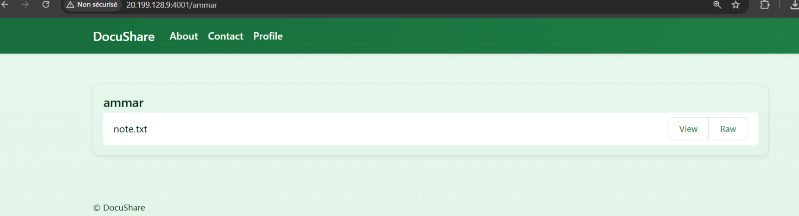
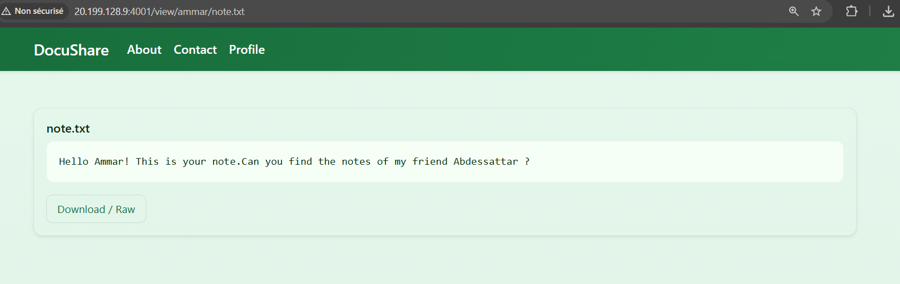

# DocuShare — IDOR & robots.txt Enumeration

## Category
Web

## Difficulty
Easy

---

## Description

DocuShare is a document-sharing platform where users can store and access notes.

The challenge description hints that **secrets can be linked**, and an additional hint is provided:

> 🤖.txt

This strongly suggests checking the `robots.txt` file.


---

## Initial Observation

Visiting the application shows the main landing page of DocuShare.


Nothing sensitive is visible at first glance, and there is no authentication mechanism.

---

## Step 1 — Checking robots.txt

Following the hint, we visit:

```
/robots.txt
```

The file contains the following commented information:

```txt
# Users:
# ammar
# abdessattar
```


Although `robots.txt` is meant for search engines, it often leaks interesting paths or usernames.

---

## Step 2 — Accessing User Pages

Using the discovered usernames, we try accessing:

```
/ammar
```

This page is accessible without authentication and displays a single file:

```
note.txt
```



---

## Step 3 — Reading the Note

Opening Ammar’s note reveals the following message:



```
Hello Ammar! This is your note.
Can you find the notes of my friend Abdessattar ?
```

This clearly hints that the target data belongs to another user: **abdessattar**.

---

## Step 4 — IDOR Exploitation

We manually navigate to:

```
/abdessattar
```

This page lists **many notes**, all accessible without any access control.


This is a classic **IDOR (Insecure Direct Object Reference)** vulnerability:
- User-controlled identifiers are used directly in URLs
- No authorization checks are performed
- Any user’s data can be accessed by guessing or enumerating identifiers

---

## Step 5 — Finding the Flag

By browsing through the available notes, we eventually find the flag inside:

```
/view/abdessattar/notes/note17.txt
```


---

## Flag

The flag found in `note17.txt` is:

```
SecurinetsISTIC{s1mpl3_1d0r_ch411_h0p3_u_f0und_th3_1d34_f4st!!}
```

---

## Behind the Scenes (Explanation)

The application directly maps URL paths to user resources without verifying:
- Who is requesting the resource
- Whether they are authorized to access it

This allows attackers to:
- Enumerate users via `robots.txt`
- Access other users’ files by changing URL paths

Proper access control checks on the backend would completely prevent this issue.

---

## Conclusion

This challenge demonstrates how small information leaks combined with missing
authorization checks can lead to full data exposure.

Key takeaways:
- `robots.txt` can leak sensitive information
- Never rely on obscurity for security
- Always enforce authorization checks on every resource
- IDOR vulnerabilities are simple but extremely dangerous

A clean and effective introduction to IDOR vulnerabilities 🔥
