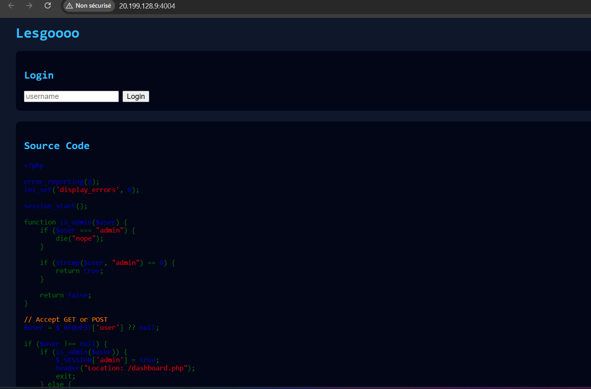
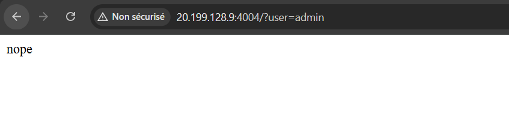
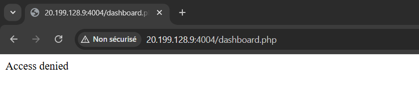
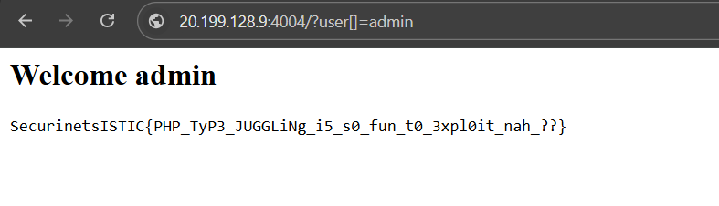

# PHP — Type Juggling Authentication Bypass

## Category
Web

## Difficulty
Easy/Medium

---

## Description

**Chnoua oumourek m3a l PHP ?**

This challenge focuses on understanding how PHP compares values
and how **type juggling** can lead to authentication bypasses.


---

## Initial Observation

Visiting the application shows a simple login page.
The page also conveniently displays its **own PHP source code**.



We are asked to log in using a username.

---

## Source Code Analysis

The critical part of the source code is the following function:

```php
function is_admin($user) {
    if ($user === "admin") {
        die("nope");
    }

    if (strcmp($user, "admin") == 0) {
        return true;
    }

    return false;
}
```

At first glance, this looks safe:
- If the user is exactly `"admin"`, execution stops
- Otherwise, `strcmp` is used to compare the input

However, this logic hides a subtle vulnerability.

---

## Normal Behavior

### Case 1 — Direct admin login

Accessing:

```
/?user=admin
```

Triggers the first condition:

```php
$user === "admin"
```

Which immediately stops execution.



---

### Case 2 — Direct dashboard access

Trying to access the dashboard directly:

```
/dashboard.php
```

Results in:

```
Access denied
```



So a valid session is required.

---

## Exploitation — PHP Type Juggling

The key issue lies in this comparison:

```php
strcmp($user, "admin") == 0
```

In PHP:
- `strcmp()` returns `0` **when strings are equal**
- But if `$user` is **not a string**, `strcmp()` returns `NULL`
- `NULL == 0` evaluates to `true`

This happens because PHP performs **loose comparison** when using `==`.

---

## Bypass Payload

We can force `$user` to be an **array** instead of a string:

```
/?user[]=admin
```

Now:
- `$user === "admin"` → `false` (array ≠ string)
- `strcmp($user, "admin")` → `NULL`
- `NULL == 0` → `true`

As a result, `is_admin()` returns `true`.

---

## Successful Exploit

After sending the payload, we are redirected to the dashboard
and granted admin access.



---

## Flag

```
SecurinetsISTIC{PHP_Typ3_JUGGL1ng_i5_s0_fun_t0_3xpl0it_nah_??}
```

---

## Behind the Scenes (Explanation)

This vulnerability exists because of:
- Loose comparisons (`==`) instead of strict comparisons (`===`)
- Assuming user input will always be a string
- Mixing strict and non-strict comparisons in authentication logic

A secure implementation would:
- Validate input types explicitly
- Avoid `strcmp()` with user-controlled input
- Use strict comparisons consistently

---

## Conclusion

This challenge demonstrates a classic **PHP type juggling vulnerability**.

Key takeaways:
- `==` performs type juggling, `===` does not
- Functions may behave unexpectedly with non-string input
- Never trust user input types
- Authentication logic must be strict and consistent

A fun and educational PHP challenge that highlights a common pitfall 🔥
