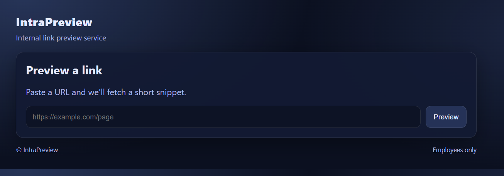
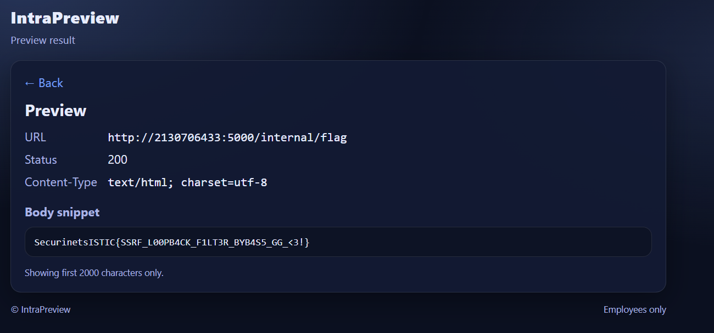

# Intra — SSRF Loopback Bypass Writeup (350 pts)

**Challenge name:** Intra  
**Author:** Rayene9052  
**Difficulty:** Medium  

---

## Overview

This challenge demonstrates a **Server-Side Request Forgery (SSRF)** vulnerability
in an internal link preview service.

Despite heavy filtering and multiple blacklist checks, a logic flaw allows access
to a protected internal endpoint by abusing **decimal IPv4 encoding**.

This writeup focuses both on **exploitation** and **understanding the source code**.

---

## Challenge Description

The application is presented as an **internal link preview service**:

> Paste a URL and we'll fetch a short snippet.

The objective is to retrieve the flag from an **internal-only endpoint**.


---

## Application Interface

The main page contains:
- A single URL input
- A *Preview* button



Since the backend fetches the provided URL, this strongly suggests **SSRF**.

---

## Initial SSRF Attempt

A classic SSRF test is accessing localhost:

```
http://127.0.0.1:5000/internal/flag
```

Result:


The server responds with:

> That destination is blocked by policy.

So:
- SSRF exists
- Internal access is explicitly restricted

---

## Source Code Walkthrough

The challenge provides full source code. Let’s break down the important parts.

---

### 1. Policy Enforcement Entry Point

```python
def policy_block(url: str) -> bool:
    u = unquote((url or "").strip())
    p = urlparse(u)
    if p.scheme not in ("http", "https"):
        return True
    return _blocked_host(p.hostname or "")
```

Key points:
- URL is parsed using `urlparse`
- Only `http` and `https` are allowed
- **Only the hostname string** is checked — not the resolved IP

---

### 2. Hostname Blacklisting Logic

```python
def _blocked_host(host: str) -> bool:
    if not host:
        return True
```

Empty hostnames are rejected immediately.

---

### 3. Special Case: Allowed Decimal Loopback

```python
ONLY_ALLOWED_LOOPBACK_HOST = "2130706433"

if h == ONLY_ALLOWED_LOOPBACK_HOST:
    return False
```

This is the **core weakness**.

The developer explicitly allows **one exact hostname**:
```
2130706433
```

This value is actually:

```
127.0.0.1 → 2130706433 (32-bit decimal IPv4)
```

---

### 4. Standard Loopback Protections

The application blocks many common bypass tricks:

```python
if h in ("localhost", "localhost.", "ip6-localhost"):
    return True
```

```python
if h.isdigit():
    return True
```

```python
if _is_ipv4ish(h):
    ip = ipaddress.ip_address(norm)
    if ip.is_loopback:
        return True
```

```python
if h.startswith("::ffff:127."):
    return True
```

```python
if h.startswith("0x") or any(c in h for c in "abcdef"):
    return True
```

These checks block:
- `127.0.0.1`
- `localhost`
- IPv6 loopback
- Hexadecimal IPs
- IPv4-mapped IPv6
- Userinfo tricks (`@`)

**Except one case**.

---

### 5. Missing Step: DNS / IP Resolution

At no point does the application:
- Resolve the hostname to an IP
- Normalize alternative IP formats
- Compare resolved IPs against loopback ranges

Filtering is done **purely on string comparison**.

---

## Exploitation — Decimal IP Encoding

IPv4 addresses can be encoded as a single 32-bit integer.

```
127.0.0.1 = 2130706433
```

This value:
- Is not caught by `isdigit()` (explicitly whitelisted)
- Matches the allowed hostname
- Resolves internally to loopback

---

## Final Payload

```
http://2130706433:5000/internal/flag
```

Result:



The request is accepted and internally routed to `127.0.0.1`.

---

## Flag

```
SecurinetsISTIC{SSRF_LOOPB4CK_F1LT3R_BYB4SS_GG_<3!}
```

---

## Internal Endpoint Check

The internal endpoint itself verifies source IP:

```python
@app.route("/internal/flag")
def internal_flag():
    if request.remote_addr not in ("127.0.0.1", "::1"):
        return "Forbidden", 403
```

Because the request is made **server-side**, `remote_addr` is loopback,
so access is granted.

---

## Root Cause Summary

The vulnerability exists because:

- Host filtering is string-based
- IP resolution is never performed
- A dangerous exception was hardcoded
- Blacklists attempt to cover formats instead of ranges

---

## Key Lessons

- Always validate **resolved IP addresses**, not hostnames
- Avoid allowlists with encoded representations
- SSRF protections must be applied **after DNS resolution**
- Blacklists are fragile and error-prone

---

## Payload Summary

| Attempt | URL |
|------|-----|
| Blocked | `http://127.0.0.1:5000/internal/flag` |
| Bypass | `http://2130706433:5000/internal/flag` |

---

A well-designed SSRF challenge highlighting how **one exception breaks all defenses**.
