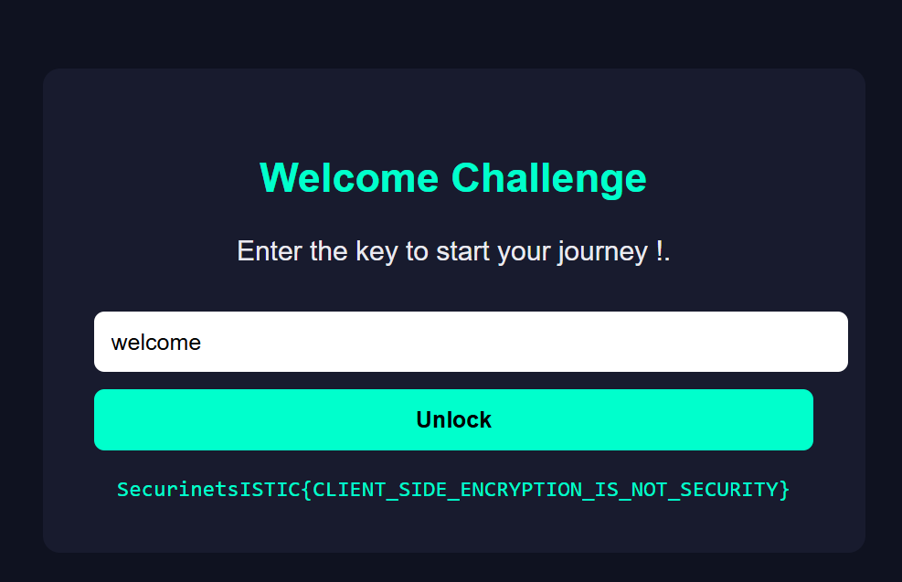

# marhbe_bik 

## Category
Web

## Difficulty
Easy (Welcome)

---

## Description

A simple welcome challenge where the goal is to find the correct key to unlock the message.

The challenge page presents a form asking for a key to start the journey.


---

## Solution

Viewing the page source reveals an HTML comment hinting to check the JavaScript file:

```html
<!-- Try looking at the JavaScript file 😉 -->
```

The page loads the following script:

```html
<script src="static/app.js"></script>
```

Inspecting `static/app.js` reveals a comment that directly gives the key:

```js
/*
  The key is: "welcome"
*/
```

The JavaScript runs entirely on the client side and uses the provided key to decrypt a hidden message.

---

## Exploit Steps

1. View the page source
2. Open `static/app.js`
3. Read the comment revealing the key
4. Enter the key in the input field

```
welcome
```

---

## Flag

After entering the correct key, the decrypted flag is displayed.

---

## Result



---

## Notes

This challenge is intended as a warm-up to introduce beginners to:
- Viewing HTML source code
- Inspecting client-side JavaScript
- Understanding that client-side logic is not secure
