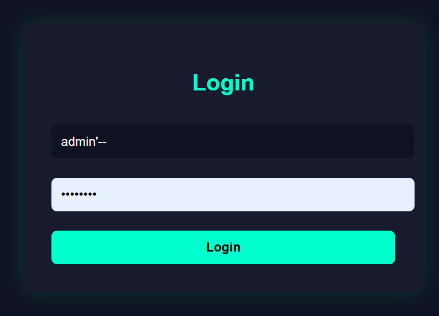
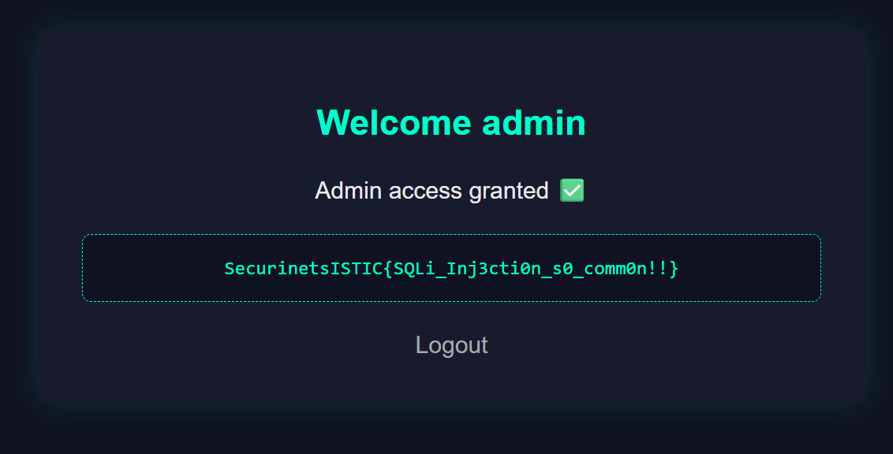

# sqli1 — Basic SQL Injection

## Category
Web

## Difficulty
Easy

---

## Description

The admin of this website has a secret hidden in his dashboard.
But… are you **him**?


---

## Analysis

The application is a Flask web app backed by an SQLite database.
Users must log in to access the dashboard.

Inspecting the login logic in `app.py` reveals the following SQL query:

```python
query = f"SELECT username FROM users WHERE username = '{username}' AND password = '{password}'"
```

User input is directly concatenated into the SQL query without any sanitization or parameterized queries.
This makes the application **vulnerable to SQL Injection**.

---

## Database Insight

From `db.py`, we know that an `admin` user exists.
However, logging in as a normal user does not reveal the flag.

---

## First Attempt (Guest Bypass)

A common SQLi payload such as:

```
' OR 1=1--
```

Successfully bypasses authentication, but logs us in as **guest** only.


This happens because the query returns the first matching row, which is not the admin user.

---

## Exploitation (Admin Bypass)

To gain admin access, the injected payload must explicitly return the **admin** user.

### Payload used in the username field:

```
admin'--
```

The password field can contain **any value**.

This results in the following SQL query:

```sql
SELECT username FROM users WHERE username = 'admin'--' AND password = '...'
```

The password check is commented out, and the application logs us in as `admin`.



---

## Flag

Once logged in as **admin**, the dashboard displays the flag:



```
SecurinetsISTIC{SQLi_Inj3ction_s0_common!!}
```

---

## Conclusion

This challenge demonstrates a classic SQL Injection authentication bypass.

Key lessons:
- Never trust user input
- Never build SQL queries using string concatenation
- Always use parameterized queries or ORM protections

A fundamental vulnerability every web security beginner should master 🔥
